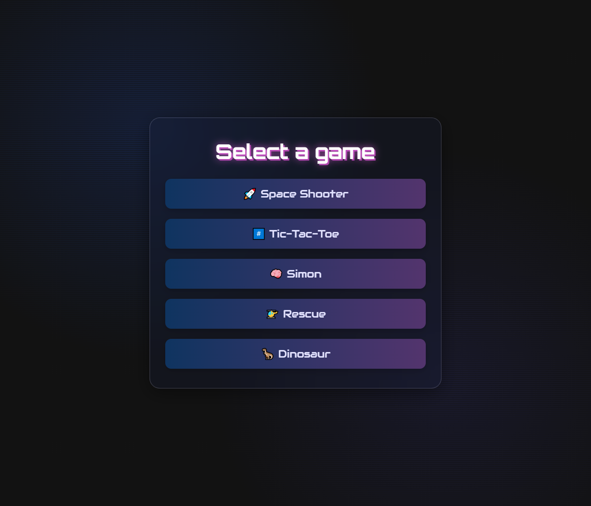

# GustavoDan Games


A modern remake of a classic web games project, rebuilt from the ground up with Next.js 15 and modern design principles.

-   **Live Version (New):** **[gustavodan-games.vercel.app](https://gustavodan-games.vercel.app/)**
-   **Original Version (Old):** **[gustavodan.github.io/DIO-Orbi-Web-Games-Developer](https://gustavodan.github.io/DIO-Orbi-Web-Games-Developer/)**

---

## ✨ About The Project

This project is a personal challenge to refactor and redesign an older project originally built with vanilla JavaScript, CSS, and HTML. The main goal is to apply modern web development practices and frameworks to create a more robust, scalable, and visually appealing application.

### 🎮 Available Games

The project includes 5 classic games, all rebuilt with modern technologies:

-   **🚀 Space Shooter** - A classic space shooter game
-   **#️⃣ Tic-Tac-Toe** - The classic tic-tac-toe game
-   **🧠 Simon** - A memory game following color sequences
-   **🚁 Rescue** - A helicopter rescue mission game
-   **🦖 Dinosaur** - A Chrome Dino-style endless runner game



### 🛠️ Built With

This project was built using the following technologies:

-   **[Next.js](https://nextjs.org/)** (v15) - React Framework
-   **[React](https://react.dev/)** (v19) - UI Library
-   **[TypeScript](https://www.typescriptlang.org/)** - Typed JavaScript
-   **[Tailwind CSS](https://tailwindcss.com/)** (v4) - CSS Framework
-   **Deployed on [Vercel](https://vercel.com/)**

### ✨ Features

-   🎨 Modern and responsive UI design
-   🎮 5 fully playable classic games
-   🔊 Sound effects and background music
-   📱 Mobile-friendly interface
-   ⚡ Optimized performance with Next.js
-   🎯 Type-safe code with TypeScript
-   💾 Local high score tracking

---

## 🚀 Getting Started

To get a local copy up and running, follow these simple steps.

### Prerequisites

Make sure you have Node.js and npm (or yarn/pnpm/bun) installed on your machine.

-   npm
    ```sh
    npm install npm@latest -g
    ```

### Installation

1.  Clone the repo
    ```sh
    git clone https://github.com/GustavoDan/gustavodan-games.git
    ```
2.  Navigate to the project directory
    ```sh
    cd gustavodan-games
    ```
3.  Install NPM packages
    ```sh
    npm install
    ```
4.  Run the development server
    ```sh
    npm run dev
    ```

Open [http://localhost:3000](http://localhost:3000) with your browser to see the result.
